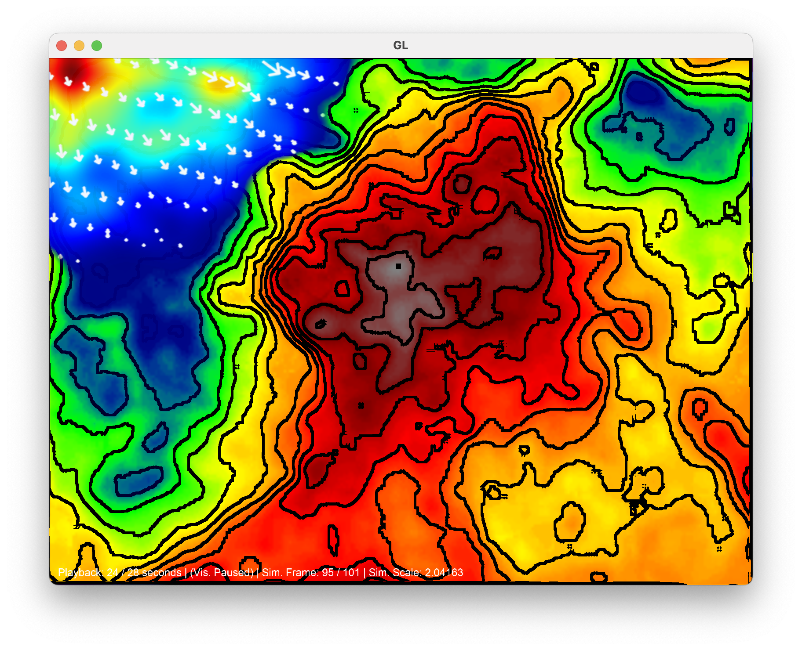

# L4 Advanced Project AR Sandbox

<table align="center">
    <tr>
        <td></td>
        <td></td>
    </tr>
    <tr>
        <td></td>
        <td></td>
    </tr>
</table>

This project is an interactive AR sandbox using an Intel RealSense depth camera, projector, and physical sandbox to visualise and simulate wave and terrain changes in real time. Designed as an educational tool, it features advanced fluid simulations via ExaHyPE and automatic computer vision-based calibration for easy setup. The system demonstrates how computer vision enhances AR sandboxes and outlines future improvements in simulation, hardware, and usability.

## Project Report

For a detailed explanation of the system design, implementation, and results, please see the [full project report (PDF)](report.pdf).

## Installation

```bash
cd <PROJECT DIR>
mkdir build
cd build
cmake ..
make
```

## Dependencies

- **C++17** or newer: Core language standard
- **CMake**: Build system
- **OpenCV**: Image processing
- **librealsense2**: Intel RealSense camera support
- **OpenGL**: Visualization
- **GLFW**: OpenGL context/window management
- **glad**: OpenGL function loader (header-only included)
- **UM-Bridge**: ExaHyPE integration
- **Docker**: ExaHyPE simulation containerization
- **VTK**: Simulation data handling
- **NetCDF**: Terrain/water data export
- **httplib**: HTTP server for remote control (header-only included)
- **nlohmann/json**: JSON parsing (header-only included)

### Details
Successfully compiled on:

- Apple Clang 17.0.0 (clang-1700.0.13.5) targeting x86_64-apple-darwin24.5 macOS Sequoia 15.5. 

Alterations should be made for Linux & Windows compatibility.

### ExaHyPE

Version included adapted from:

https://github.com/annereinarz/ExaHyPE-Tsunami/tree/main

## Usage

### With Pre-recorded RealSense Bag File

```bash
./l4project \
    --bag 20250321_083813.bag \
    --calibrate
```

<!-- --diff './rotated_japan_map_col.png' \ -->

### Example: Manual Point Selection

```bash
./l4project \
    --bag '20250321_083449.bag' \
    --points 285,218 488,205 503,358 282,370
```

### With Camera

**Automatic calibration:**
```bash
./l4project --calibrate
```

**Manual user calibration:**
```bash
./l4project
```

## ExaHyPE

- ExaHyPE configured to accept two input files that reside in the `in` directory. These are netCDF files `output.nc` and `water.nc` that contain the sand topography and water heights from the application.
- Upon simulation completion the `output` directory contains the VTK timestamped files that are automatically read into the application.

- These folders are mapped to their corresponding directories within the docker image `.../sandbox_input` & `/output` respectively.


**Docker Run Command**
```bash
docker run --rm -p 4242:4242 \
    -v ./ExaHyPE/out:/output \
    -v ./ExaHyPE/in:/ExaHyPE-Tsunami/ApplicationExamples/SWE/SWE_sandbox/sandbox_input \
    testsim
```
<!-- ```bash
docker run --rm -p 4242:4242 \
    -v /Users/macauley/Development/T/out:/output \
    -v /Users/macauley/Development/T/in:/ExaHyPE-Tsunami/ApplicationExamples/SWE/SWE_sandbox/sandbox_input \
    testsim
``` -->

**Docker Build**
```bash
cd ExaHyPE
docker build .
```

**Docker Cloud Build**
```bash
docker buildx build --builder cloud-mbgward-sim . --load -t testsim1
```


## Ports

| Service   | Port  |
|-----------|-------|
| ExaHyPE   | 4242  |
| Web UI    | 18080 |


## Main Loop

### Initialisation
- `Simulation`: Handles simulation data loading and rendering.
- `Camera`: Manages RealSense camera input or .bag playback.
- `Calibration`: Performs ROI & checkerboard-based calibration.
- `Visualization`: Renders terrain and water textures using OpenGL.
- `Remote` Control: Starts an HTTP server for RESTful API web control.

Configures `GLFW` for `OpenGL` rendering.

If --calibrate is specified: Captures frames from the RealSense camera. Detects and processes the sand region or checkerboard for calibration. Sets the camera's region of interest (ROI) based on calibration results.

### Main Loop


<p align="center">
    
</p>

- **Frame Capture:**  
    Captures depth and color frames from the RealSense camera using `camera.pipe.poll_for_frames(&frames)`. Applies spatial, temporal, and hole-filling filters to the depth data. Data is exchanged between RealSense, OpenCV, and OpenGL, for example:

    ```cpp
    cv::Mat depthMat(
        camera.depthSize,
        CV_16UC1,
        (void*)depthFrame.get_data(),
        cv::Mat::AUTO_STEP
    );
    ```

- **Motion Detection:**  
    Compares consecutive depth frames to detect motion `cv::threshold(diff, threshDiff, 30, 255, cv::THRESH_BINARY)`. Displays motion masks and saves results if requested.

- **Simulation:**  
    Advances simulation frames and renders results with `void Simulation::advanceFrame(float &maxValue)`. Loads VTK sequence files one by one per frame update, delay can be imposed. Updates simulation OpenGL textures and scales based on data. Passed to `Visualisation` for final display.

    Also triggers `ExaHyPE` simulation using `UM-Bridge` in separate thread, careful mutex & flow control prevent issues.

- **Water:**
    Provides canvas for water simulation input combined into `Visualisation`.

- **Visualisation:**  
    Loads OpenCV images into OpenGL, loads shaders to display in application, 2D quad used as display surface `Visualisation::draw(...)`.


<p align="center">
    
</p>

- **Remote Interaction:**  
    Handles HTTP requests to control visualization and simulation. Mutex locks control multi threaded server to prevent memory issues.


## Physical Design

<p align="center">
    
</p>

## Command Line Arguments

| Argument                        | Description                                                      |
|----------------------------------|------------------------------------------------------------------|
| `--image <path>`                 | Specifies the input image file path.                             |
| `--bag <path>`                   | Specifies the RealSense bag file path for input.                 |
| `--fullscreen`                   | Enables fullscreen mode for the application.                     |
| `--help` or `-h`                 | Displays usage information and exits.                            |
| `--points <x1,y1 x2,y2 x3,y3 x4,y4>` | Specifies four points in the format x,y for manual calibration. |
| `--host <address>`               | Specifies the host address for remote connections.               |
| `--simulationInput <path>`       | Specifies the input path for simulation data.                    |
| `--simulationOutput <path>`      | Specifies the output path for simulation results.                |
| `--calibrate`                    | Enables automatic calibration mode.                              |
| `--diff <path>`                  | Specifies the path to the difference map image.                  |
| `--temporalAlpha <value>`        | Sets the temporal alpha value for filtering.                     |
| `--temporalDelta <value>`        | Sets the temporal delta value for filtering.                     |

## Keyboard Shortcuts

| Key                | Action                                                        |
|--------------------|---------------------------------------------------------------|
| Q                  | Close the application.                                        |
| T                  | Toggle water texture.                                         |
| F                  | Toggle gradient color mode.                                   |
| G                  | Toggle grayscale mode.                                        |
| [                  | Decrease contour line factor.                                 |
| ]                  | Increase contour line factor.                                 |
| P                  | Reset contour line factor to default.                         |
| O                  | Set contour line factor to 0.                                 |
| ` (Grave Accent)   | Toggle debug windows.                                         |
| S                  | Save the current visualization as an image (image.png).       |
| E                  | Load simulation sequence paths.                               |
| C                  | Save the current terrain image to NetCDF format.              |
| I                  | Increase simulation offset.                                   |
| U                  | Decrease simulation offset.                                   |
| R                  | Toggle visualization pause.                                   |
| /                  | Run simulation and save terrain and water depth to NetCDF.    |
| W                  | Reset the simulation.                                         |
| H                  | Flip the visualization along the Y-axis.                      |
| V                  | Flip the visualization along the X-axis.                      |
| 1, 2, 3, 4         | Update vertex positions from mouse input.                     |
| =                  | Increase water canvas intensity.                              |
| -                  | Decrease water canvas intensity.                              |
| 0                  | Clear the water canvas.                                       |
| ;                  | Cycle through colormap indices.                               |
| D                  | Toggle simulation field.                                      |
| F1                 | Add a marker point at the current mouse position (up to 2).   |
| F2                 | Sample points along a line between two markers.               |
| F3                 | Display the current OpenGL image in a debug window.           |
| F4                 | Toggle filtering.                                             |
| F5                 | Save the next frame.                                          |
| Z                  | Toggle the difference canvas.                                 |
| F6                 | Save the water depth map to a timestamped .tiff file.         |
| .                  | Load the next .tiff file from the ../waters directory.        |

